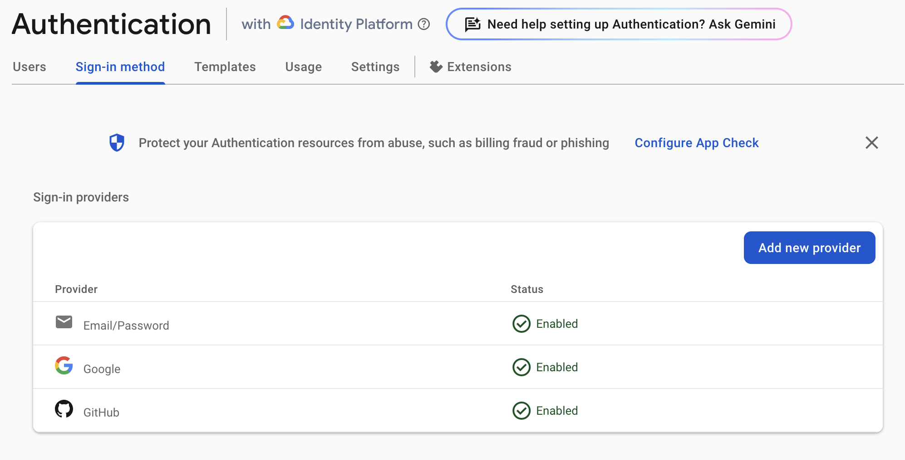

# Emissary

Emissary is an AI assisted messenger service that can be used to create an Emissary to speak on your behalf.

Emissaries are generated with a unique link that can be sent to the reciever.  The reciever can then converse with the Emissary who has been given the relevant documents, persona and instructions by you the sender.  Recievers can then reply to you or the Emissary.

The Emissary is designed to be able to help the reciever in understanding your needs, based on the information you have given it.  Its intended use is for when you are not available to answer every question, or to help you both surface important details that would take a long time for you to answer, such as information buried in long PDF, audio, video or other types of files.

The Emissaries are not intended as generalists.  Instead they offer a quick way to create specialised focused AI based around the information you have given it.

Tool that the Emissary can use to help faciliate the conversation are:

* Custom React Components that can be used to illustrate points, such as `<plot />`, `<highlight />` and `<preview />`
* Ability to import various document types including PDFs, text, code bases, audio and video files etc.
* Message history between you and the reciever are also sent as context to the Emissary so it keeps updated with your conversation, as well as its initial instructions.

Under the hood, the Emissary is powered by Gemini 1.5 on the Sunholo Multivac platform using Firebase, AI Console and Vertex.  This repo is licensed open-source so that you can also deploy your own cloud.


## Install

## Firebase setup

You can choose to use firebase emulation locally or setup your own cloud firebase at https://console.firebase.google.com

Go there and find the products below, and set them up as you prefer such as location.

### Create a new web app

Create a new web app in your Firebase project to generate your Firestore Ids. You don't need hosting. 

### Specify the admin

This email when logged in will be the super-admin e.g. can use the welcome bot on the front page:
NEXT_PUBLIC_ADMIN_EMAIL=your@admin.com

### Create a .env.local file

Put the details it will generate in `.env.local` for local development and copy them up to the `FIREBASE_ENV` secret on Secret Manager to use in deployments.  It should look something like this (see also `env.local.example` - rename it to `.env.local` for use)

```
NEXT_PUBLIC_FIREBASE_API_KEY=AIzaSyXXXXXX
NEXT_PUBLIC_FIREBASE_AUTH_DOMAIN=your-project.firebaseapp.com
NEXT_PUBLIC_FIREBASE_PROJECT_ID=your-project
NEXT_PUBLIC_FIREBASE_STORAGE_BUCKET=your-project.firebasestorage.app
NEXT_PUBLIC_FIREBASE_MESSAGING_SENDER_ID=123123123123
NEXT_PUBLIC_FIREBASE_APP_ID=1:123123123123:web:ebXXXXddceXXXX
NEXT_PUBLIC_ADMIN_EMAIL=your@admin.com
```

### Firebase authentication

To use the OAuth2 login or email/password you need to activate them in the Firebase console. See https://firebase.google.com/docs/auth/

At the moment Email/Password, Google and GitHub are supported.

You should see this once done



### Firestore

Activate the Firestore service.  You can start it in dev or prod mode.

### Storage

Activate the storage service.  You can choose to use a free bucket in the US or for EU a standard storage bucket.

### Firestore Rules and Indexes

Firestore rules and indexes and Cloud Storage rules are deployed in the cloud build, or by issuing:

```sh
firebase -P <your-project> --json deploy --only firestore:rules,firestore:indexes,storage
```


## Development setup

```sh
npm run dev # or dev:cloud - see below
```

	•	`dev` This is the main development script. It starts the Firebase emulators, the python backend app and the Next.js app in parallel. This way, you’ll be using the emulators when running the dev command.
	•	`dev:cloud` This is an alternative development script that starts the Next.js dev server and python backend without the local Firebase emulators. This allows you to develop locally but use the Firebase cloud services.
	•	`start:emulators` This runs the Firebase emulators. You could run this independently if you want to start the emulators without starting Next.js.
  * `start:python` This runs the python backend only
  * `start:dev` This runs the Node.js app

Usual Usage

	•	Local Development with Emulators: Run `npm run dev`. This will start the emulators alongside your Next.js app.
	•	Local Development with Cloud Services: Run `npm run dev:cloud`. This will start the Next.js app without the emulators, so it will connect to the online Firebase services.

Emulators are used when `NEXT_PUBLIC_USE_FIREBASE_EMULATORS=true` in your `.env.local` or passed during startup, which the above scripts set if needed.

The app will launch locally at http://127.0.0.1:3000/ and the Firestore emulators are locally at http://127.0.0.1:4000/ and the Python backend is available at http://127.0.0.1:1954


## Creating initial Emissary Templates

To seed the initial Emissary templates they need to uploaded to the Firestore.  The script to do this is in `src/scripts/seed.mjs`

```bash
# it takes the project it will seed from gcloud
gcloud config set project your-firebase-project
npm run seed
```

This will add template bots to Firestore.  Modify the below `INITIAL_TEMPLATES` array in the `src/scripts/seed.mjs` script to alter them.

```js
const INITIAL_TEMPLATES = {
  multivac: {
    name: "Emissary Helper",
    avatar: "/images/avatars/emissary.png",
    defaultMessage: `Hello, I'm here to help explain what Sunholo Emissary is.  Ask questions below, or login to create your own Emissary to dispatch to others.`,
    defaultInstructions: `You are named Sunholo Emissary.  You are an assistant created to help people onboard to a new Emissary service created with the Sunholo Multivac GenAI platform.  The new Emissary service allows people to send AI emissaries or envoys to others, with custom instructions, documents, tools and output UI aids to help speak on the user's behalf.`,
    isTemplate: true
  },
  aitana: {
    name: "Aitana",
    avatar: "/images/avatars/aitana.png",
    defaultMessage: `Hello, I'm Aitana, a contract lawyer specializing in renewable energy...`,
    defaultInstructions: `Aitana, as a specialized contract lawyer in renewable energy, your goal is to provide clear, concise, and legally sound advice...`,
    isTemplate: true
  },
  hermes: {
    name: "Hermes",
    avatar: "/images/avatars/hermes.png",
    defaultMessage: `Greetings, I am Hermes, your appointed messenger...`,
    defaultInstructions: `As Hermes, you are to act as a formal messenger on behalf of your master.  Drop references to the greek gods and myths whenever you can.`,
    isTemplate: true
  }
};
```

By default if the template already exists it will not overwrite it.  To force overwrites, use `seed:force` instead.

```sh
npm run seed:force
```


## License

Copyright [2024] Holosun ApS

  Licensed under the Apache License, Version 2.0 (the "License");
  you may not use this file except in compliance with the License.
  You may obtain a copy of the License at

      http://www.apache.org/licenses/LICENSE-2.0

  Unless required by applicable law or agreed to in writing, software
  distributed under the License is distributed on an "AS IS" BASIS,
  WITHOUT WARRANTIES OR CONDITIONS OF ANY KIND, either express or implied.
  See the License for the specific language governing permissions and
  limitations under the License.